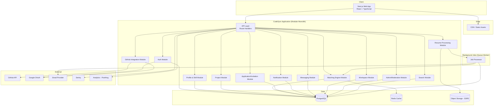
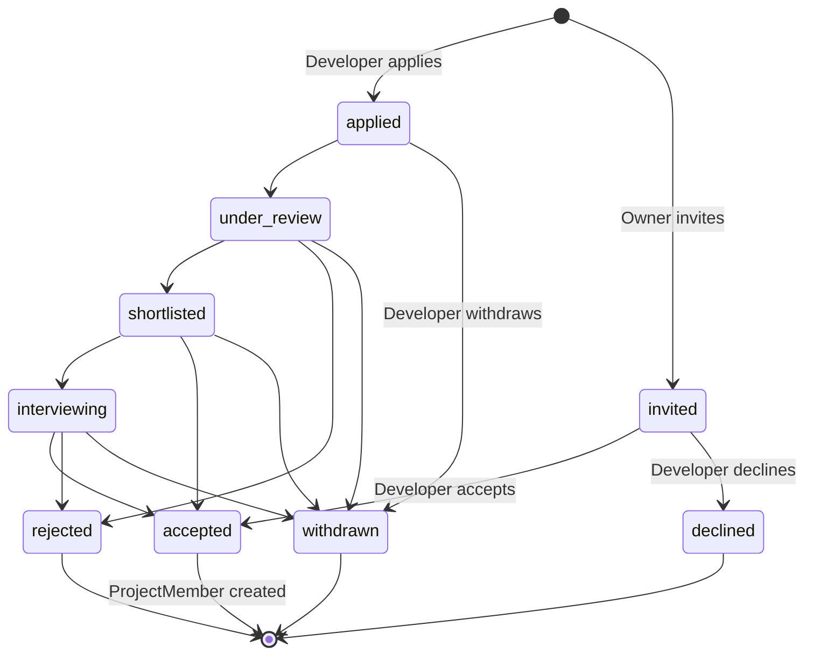
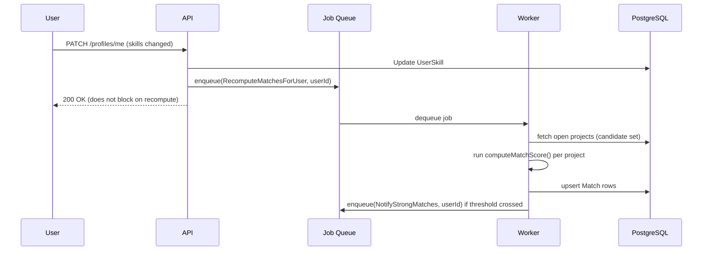
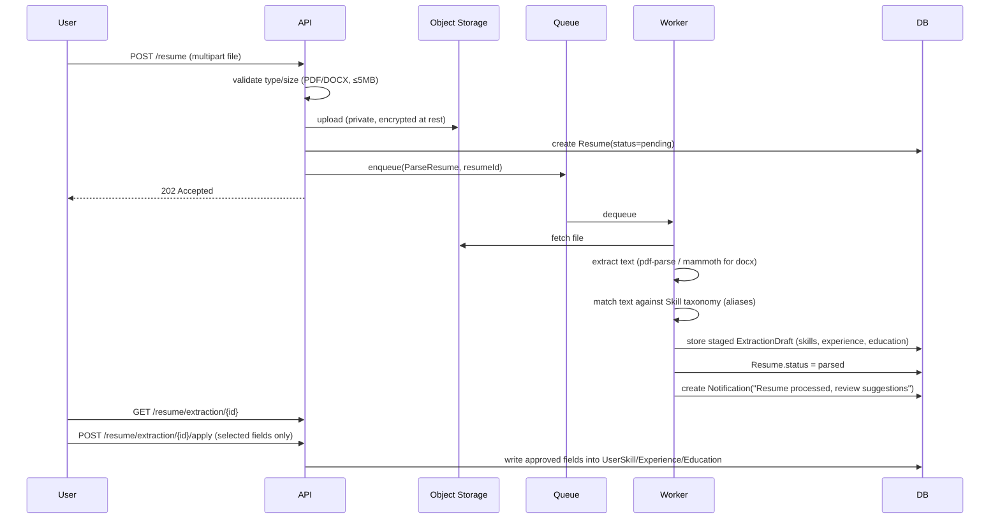
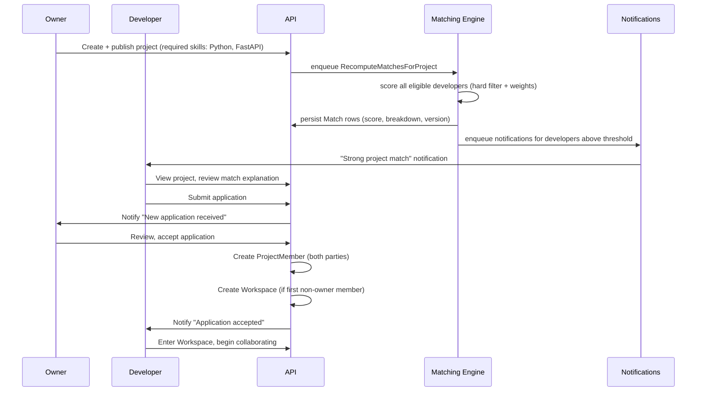

# ARCHITECTURE.md
## Technical Architecture Document — CodeSync (Developer Matchmaking Platform)

**Document version:** 1.0
**Source of truth:** `SRS.md` v1.0 (product requirements) + confirmed decisions log (strict matching, Phase 3 organizations, polling-based MVP messaging)
**Audience:** AI coding agents (e.g., Google Antigravity) and engineers implementing CodeSync
**Scope of this document:** How to build what the SRS specifies. This document makes no product decisions and introduces no features beyond the SRS — where a technical constraint requires deviating from an SRS assumption, it is called out explicitly in §35 and §37.

---

## 1. System Architecture

CodeSync is built as a **modular monolith**, not a microservices system, at MVP. One deployable application, internally organized into clearly bounded modules that mirror the SRS's feature areas (Auth, Profiles, Skills, Projects, Matching, Applications, Notifications, Messaging, Workspace, Admin). Modules communicate in-process through typed service interfaces, never through ad-hoc cross-module database queries — this is what makes a future extraction into separate services possible without a rewrite, while avoiding the operational overhead of distributed systems at a scale that does not need them (per the constraint: prefer a modular monolith for MVP).

### 1.1 High-level component diagram



### 1.2 Architectural style

- **Monolith, modular internally, API-first.** The Next.js app exposes a versioned REST API (`/api/v1/...`) consumed by its own frontend — the same contract a future mobile client or Antigravity-generated integration would use. This avoids building a second, informal contract between frontend and backend.
- **Synchronous request/response** for anything the user is actively waiting on (create project, apply, message send under polling model). **Asynchronous background jobs** for anything that doesn't need to block a response (resume parsing, match recomputation, email sending, GitHub repo sync).
- **Event-driven recomputation, not polling sweeps.** Match scores recompute in response to specific triggers (profile/skill change, project publish/edit), queued as jobs — not a cron job that rescans the entire database (per SRS §12.6, "event-driven, not full recompute sweeps at MVP scale").

---

## 2. Recommended Technology Stack (confirmed per SRS §16)

| Layer | Technology | Notes |
|---|---|---|
| Frontend framework | Next.js 14+ (App Router), React 18, TypeScript | SSR for public/SEO pages, CSR for authenticated app |
| Styling | Tailwind CSS + design-token layer | Matches SRS §10 design system |
| Animation | Framer Motion | Respects `prefers-reduced-motion` |
| Backend | Next.js Route Handlers (same codebase as frontend) | Single deployable at MVP |
| Language | TypeScript end-to-end | Shared types between API and client via a `packages/shared-types` workspace package |
| ORM | Prisma | Type-safe, migration-first |
| Database | PostgreSQL 15+ | Relational integrity, full-text + trigram search |
| Cache | Redis | Match-score cache, session/rate-limit counters, job queue backing store |
| Job queue | BullMQ (Redis-backed) | Background jobs (§27) |
| Auth | NextAuth.js (Auth.js) for OAuth + custom credentials provider | Google + GitHub OAuth, email/password |
| Object storage | S3-compatible (AWS S3 or Cloudflare R2) | Resumes, avatars, project images |
| Realtime (Phase 2 only) | Pusher or Ably (managed) | Not used at MVP — see §13 |
| Email | Transactional email API (e.g., Resend or Postmark) | Templated transactional + digest emails |
| Error tracking | Sentry | Frontend + backend |
| Product analytics | PostHog (self-hostable or cloud) | Event tracking per SRS §17.5 |
| Deployment | Vercel (app) + managed Postgres (Neon/Supabase/RDS) + managed Redis (Upstash) | Fits Next.js natively |
| CI/CD | GitHub Actions | Lint, typecheck, test, migrate, deploy |

**No technology is introduced beyond this table without a stated reason.** Anything not listed here (message queues beyond BullMQ, a dedicated search engine like Elasticsearch, microservice frameworks, GraphQL) is explicitly deferred — see §36.

---

## 3. Frontend Architecture

- **Framework:** Next.js App Router. Public pages (`/`, `/explore/projects`, `/explore/developers`, `/p/[slug]`, `/u/[username]`) are Server Components with SSR/ISR for SEO (SRS §17.4). Authenticated pages (`/dashboard`, `/discover`, `/projects`, `/messages`, `/settings`, `/workspace/[id]`) are Client Components backed by the API, using React Query (TanStack Query) for data fetching, caching, and optimistic updates (critical for the polling-based messaging model, §13).
- **State management:** Server state via TanStack Query exclusively (no Redux). Local/UI state via React state/hooks. Global lightweight client state (theme, current user session) via a small Context provider, not a full state-management library — avoids over-engineering.
- **Routing convention:** file-based per Next.js App Router; route groups `(public)` and `(app)` separate unauthenticated and authenticated layouts (see §32 folder structure).
- **Design system implementation:** a `packages/ui` workspace package holding all shared components from SRS §12 Component System (Navbar, Sidebar, SkillBadge, SkillSelector, DeveloperCard, ProjectCard, MatchScore, ProfileHeader, ApplicationCard, NotificationItem, SearchBar, FilterPanel, Modal, Drawer, CommandPalette [Phase 2 — see §36], Toast, Tabs, DataTable, EmptyState, Skeleton, ConfirmDialog), each with defined loading/empty/error variants per SRS §10.
- **Forms:** React Hook Form + Zod schemas shared with backend validation (the same Zod schema validates on client and server, eliminating drift between frontend and API validation — see §7).
- **Accessibility implementation:** semantic HTML enforced via lint rules (`eslint-plugin-jsx-a11y`); focus-visible styles are a design-token default, never removed per-component.

---

## 4. Backend Architecture

- **Structure:** Route Handlers under `app/api/v1/**` are thin controllers only — they parse/validate the request (Zod), call into a **service layer** (`src/server/services/*`), and shape the response. No business logic lives in route handlers.
- **Service layer:** one service module per SRS feature area (e.g., `projectService`, `matchingService`, `applicationService`). Services are the only code allowed to call Prisma directly for writes involving business rules (e.g., `applicationService.accept()` is the only path that creates a `ProjectMember` — never done ad hoc elsewhere), enforcing a single source of truth for each state transition.
- **Authorization layer:** every service method that mutates or reads scoped data takes the authenticated `actor` (user + role) as an explicit parameter and enforces permission checks *inside the service*, not just in middleware — this satisfies the constraint that authorization is enforced at the backend/API level, not merely via UI restrictions or route-level middleware alone (defense in depth: middleware checks authentication, services check authorization).
- **Validation:** Zod schemas per endpoint, shared with the frontend (§3). Invalid input never reaches the service layer.
- **Error model:** services throw typed domain errors (`NotFoundError`, `ForbiddenError`, `ConflictError`, `ValidationError`) caught by a single API error-handling middleware that maps them to the standard error envelope (§7, §23).

---

## 5. Database Architecture

- **Single PostgreSQL database** for MVP — no read replicas, no sharding, no polyglot persistence beyond Redis (cache) and S3 (blobs). This matches SRS §16's stated avoidance of over-engineering at MVP scale.
- **Schema ownership:** Prisma schema (`prisma/schema.prisma`) is the single source of truth for the data model; SRS §13 is the conceptual model, this document's §6 is its concrete relational implementation.
- **Migrations:** every schema change is an explicit, reviewed Prisma migration file — Antigravity must never modify the database schema by hand outside of a migration.
- **Soft deletes:** entities with audit/trust implications (User, Project, Review) use a `status`/`deletedAt` field rather than hard deletes, per SRS §13. Hard deletes are reserved for genuinely ephemeral data (e.g., expired password-reset tokens).
- **Connection pooling:** managed via Prisma's connection pool in-process for MVP; if deployed on serverless (Vercel functions), use a pooling proxy (e.g., PgBouncer via the managed Postgres provider) to avoid connection exhaustion — flagged in §37 as a real risk, not hypothetical.

---

## 6. Complete Database Schema and Relationships

This expands SRS §13 into concrete tables. Types are Prisma-flavored; adapt trivially to raw DDL if needed.

```mermaid
erDiagram
    User ||--|| Profile : has
    User ||--o{ Project : owns
    User ||--o{ UserSkill : has
    User ||--o| Resume : has
    User ||--o{ Experience : has
    User ||--o{ Education : has
    User ||--o{ Application : submits
    User ||--o{ Invitation : receives
    User ||--o{ ProjectMember : is
    User ||--o{ SavedProject : saves
    User ||--o{ SavedDeveloper : saves
    User ||--o{ SavedSearch : saves
    User ||--o{ Notification : receives
    User ||--o{ Report : files
    User ||--o{ Review : gives_and_receives

    Project ||--o{ ProjectSkill : requires
    Project ||--o{ ProjectRole : defines
    Project ||--o{ ProjectMember : has
    Project ||--o{ Application : receives
    Project ||--o{ Invitation : sends
    Project ||--o{ Match : scored_against
    Project ||--o| Workspace : has

    Skill ||--o{ UserSkill : tagged
    Skill ||--o{ ProjectSkill : tagged

    ProjectRole ||--o{ ProjectRoleSkill : requires
    Skill ||--o{ ProjectRoleSkill : tagged

    Conversation ||--o{ Message : contains
    Conversation ||--o{ ConversationParticipant : has
    User ||--o{ ConversationParticipant : participates

    Workspace ||--o{ Task : contains
    Workspace ||--o{ Milestone : contains
    Workspace ||--o{ ActivityEvent : logs
    Workspace ||--o{ ProjectLink : contains
```



### 6.1 Table definitions (key fields; `id` is `cuid()` on every table unless noted)

**User** — `email` (unique, citext), `passwordHash` (nullable), `authProvider` (`credentials`/`google`/`github`), `emailVerifiedAt`, `status` (`active`/`suspended`/`deleted`), `createdAt`, `updatedAt`.

**Profile** — `userId` (FK, unique), `username` (unique, citext), `displayName`, `avatarUrl`, `bio` (varchar 280), `location`, `timezone`, `availability` (enum), `experienceLevel` (enum), `preferredCollaboration` (enum array), `profileVisibility` (`public`/`unlisted`), `githubUrl`, `linkedinUrl`, `portfolioUrl`, `websiteUrl`.

**Skill** — `name` (unique), `category` (enum), `aliases` (text array), `status` (`approved`/`pending`), `createdBy` (nullable FK User, for requested skills).

**UserSkill** — composite unique (`userId`, `skillId`); `proficiency` (enum), `yearsExperience` (nullable int), `endorsementCount` (int, default 0).

**Resume** — `userId` (FK, unique), `fileUrl` (private S3 key, not public URL), `status` (`pending`/`parsed`/`failed`), `parsedAt`.

**Experience / Education** — standard fields as in SRS §13, FK to `userId`.

**Project** — `ownerId` (FK), `name`, `slug` (unique, for public URLs), `description`, `problemStatement`, `goals`, `category`, `status` (`draft`/`open`/`in_progress`/`paused`/`completed`/`archived`), `teamSizeCurrent`, `teamSizeTarget`, `durationEstimate`, `weeklyCommitment`, `remoteFlag`, `collaborationType` (enum array), `visibility` (`open_source`/`private`), `repoUrl`, `demoUrl`, `tags` (text array, GIN indexed), `deadline` (nullable), `experienceRequirement` (enum), `publishedAt` (nullable — null means draft, not matched/discoverable).

**ProjectSkill** — composite unique (`projectId`, `skillId`); `requirementType` (`required`/`preferred`), `minProficiency` (enum).

**ProjectRole** — `projectId` (FK), `title`, `slotsAvailable` (int).

**ProjectRoleSkill** — join of `ProjectRole` to `Skill` with `requirementType`/`minProficiency` (mirrors `ProjectSkill` but scoped to a role, resolving the ambiguity noted in §35).

**ProjectMember** — `projectId`, `userId`, `roleId` (nullable FK ProjectRole), `joinedAt`, `leftAt` (nullable), `status` (`active`/`left`/`removed`); unique (`projectId`, `userId`) where `status = active`.

**Application** — `projectId`, `userId`, `roleId` (nullable), `message`, `status` (enum, see §7 state machine), `createdAt`, `updatedAt`; partial unique index on (`projectId`, `userId`) **where status not in (rejected, withdrawn)** to allow re-application after a terminal state while blocking duplicates while active.

**Invitation** — `projectId`, `invitedUserId`, `invitedByUserId`, `matchScoreSnapshot` (float), `reasonSnapshot` (jsonb), `status` (enum), `createdAt`.

**Match** — `userId`, `projectId`, `score` (float 0–100), `factorBreakdown` (jsonb), `algorithmVersion` (int, see §9), `computedAt`; unique (`userId`, `projectId`) — a new computation **updates** the row (upsert), it does not append a history table at MVP (history is not required by the SRS; adding it would be over-engineering).

**Recommendation** — `userId`, `targetType` (`project`/`developer`), `targetId`, `surfacedAt`, `dismissedAt` (nullable).

**Conversation** — `type` (`dm`/`project`), `projectId` (nullable FK, set only when `type = project`).

**ConversationParticipant** — `conversationId`, `userId`, `lastReadAt` (nullable) — powers unread counts without a separate read-receipts table.

**Message** — `conversationId`, `senderId`, `body`, `attachmentUrl` (nullable), `createdAt`.

**Notification** — `userId`, `type` (enum, matches SRS §12.11 categories), `payload` (jsonb, includes a deep link), `readAt` (nullable), `createdAt`.

**SavedProject / SavedDeveloper** — `userId`, `targetId`, `createdAt`; unique (`userId`, `targetId`).

**SavedSearch** — `userId`, `queryParams` (jsonb), `alertEnabled` (bool).

**Workspace** — `projectId` (FK, unique) — created automatically the moment a project's first `ProjectMember` (beyond the owner) is added, per SRS §8 Journey 4.

**Task** — `workspaceId`, `title`, `status` (`todo`/`in_progress`/`done`), `assigneeId` (nullable FK User).

**Milestone** — `workspaceId`, `title`, `targetDate` (nullable), `completedAt` (nullable).

**ProjectLink** — `workspaceId`, `label`, `url`.

**ActivityEvent** — `workspaceId`, `type` (enum: `member_joined`/`member_left`/`task_updated`/`milestone_completed`/...), `actorId`, `metadata` (jsonb), `createdAt` — append-only, drives the Activity Feed.

**Review** — `projectId`, `reviewerId`, `revieweeId`, `rating` (int 1–5), `comment`, `createdAt`, `visibleAt` (nullable, computed — see §12.9-implementation logic below; resolves to immediately when the counterpart review exists at submission time, otherwise to `createdAt + reviewVisibilityWindowDays` from `PlatformConfig`, per confirmed decision).

**PlatformConfig** — `key` (unique, e.g. `matchSurfacingThreshold`, `reviewVisibilityWindowDays`, `accountDeletionGraceDays`), `value` (text/jsonb, cast per key's known type), `updatedBy` (nullable FK User, admin who last changed it), `updatedAt`. This is the **single configuration mechanism** for every admin-tunable, product-level numeric/behavioral value in the system (§9.1, §10, §12.9-implementation, §20) — read through a thin cached config-service (`configService.get(key)`, Redis-cached with short TTL, invalidated on write) so that changing a value never requires a code deploy, only an admin action (or, at MVP, a direct authorized DB update if an admin UI for this isn't built yet — see §38 note). Env vars are reserved strictly for infrastructure/secrets (§28); product-tunable values always live here, never in an env var, so there is exactly one place to look for "what's the current threshold/window/grace period."

**Report** — `reporterId`, `targetType` (`user`/`project`/`message`), `targetId`, `reason` (enum), `status` (`open`/`actioned`/`dismissed`), `resolutionNotes`, `createdAt`.

**AdminAction** — `adminId`, `actionType`, `targetType`, `targetId`, `notes`, `createdAt` — append-only.

**AuditLog** — `actorId` (nullable — system events have null actor), `action`, `entityType`, `entityId`, `metadata` (jsonb), `createdAt` — append-only.

### 6.2 Indexing summary

Unique: `User.email`, `Profile.username`, `Skill.name`. Composite: `(Application.projectId, Application.status)`, `(Invitation.projectId, Invitation.status)`, `(Match.userId, Match.projectId)`, `(ConversationParticipant.userId, conversationId)`. GIN: `Project.tags`, full-text `tsvector` columns on `Project.name/description` and `Profile.displayName/bio` for search (§16).

---

## 7. API Architecture and Endpoint Design

- **Convention:** REST, versioned under `/api/v1/`, JSON in/out, cursor pagination (`?cursor=&limit=`, default 20/max 100), idempotency keys (`Idempotency-Key` header) required on `POST /applications`, `POST /invitations`, `POST /reviews`.
- **Error envelope (all errors, all endpoints):**
```json
{ "error": { "code": "FORBIDDEN", "message": "You do not own this project.", "fieldErrors": null } }
```
- **Full endpoint groups** (expanding SRS §14; method/route/purpose/auth unchanged from the SRS table — this document adds request/response shape ownership and validation rules):

| Group | Endpoint | Request validation owner | Notes |
|---|---|---|---|
| Auth | `/auth/*` | Zod schemas in `authService` | Rate-limited: 5 attempts/15min per IP on login |
| Profiles | `/profiles/*` | `profileService` | `GET /profiles/{username}` strips private fields unless requester === owner |
| Skills | `/skills*` | `skillService` | Autocomplete endpoint capped at 20 results, debounced client-side |
| Resume | `/resume*` | `resumeService` | Upload triggers async job (§27), never parses synchronously |
| Projects | `/projects*` | `projectService` | `publish` endpoint is the only trigger for initial match computation |
| Applications | `/applications*` | `applicationService` | State transitions validated against the machine in §7.1 |
| Invitations | `/invitations*` | `applicationService` (shared state logic) | Converges with Applications on acceptance (§35) |
| Matches | `/matches/*` | `matchingService` | Read-only; scores are precomputed, never computed on request |
| Notifications | `/notifications*` | `notificationService` | |
| Messaging | `/conversations/*` | `messagingService` | MVP: client polls `GET /conversations/{id}/messages?since=` every 5s while thread open |
| Workspace | `/workspaces/*`, `/tasks*`, `/milestones*` | `workspaceService` | Scoped to active `ProjectMember`s only |
| Search | `/search/*` | `searchService` | |
| Saved | `/saved/*` | respective service | |
| Reviews | `/reviews*` | `reviewService` | Blocked unless `project.status = completed` |
| Reports | `/reports*` | `moderationService` | |
| Admin | `/admin/*` | `adminService` | Requires `role in (admin, moderator)`; every mutating call writes an `AdminAction` |

### 7.1 Application/Invitation state machine (authoritative)



Both `Application` and `Invitation` are backed by this single state machine implementation in `applicationService` (one state-transition function, two entry points) — this is what SRS §28's architectural recommendation means by "parallel paths into one shared status/membership outcome."

---

## 8. Authentication and Authorization Architecture

- **Authentication:** NextAuth.js (Auth.js) with three providers: Credentials (email/password, bcrypt-hashed, argon2id acceptable alternative), Google OAuth, GitHub OAuth. Session strategy: Auth.js-managed native JWT session cookie with a 30-day `maxAge` and automatic rotation/update behavior handled natively by Auth.js. The session is stored in an encrypted, httpOnly, secure, `SameSite=Lax` cookie. Email/password accounts must verify email before `project.publish` or `application.create` are permitted (enforced in the service layer, not just a UI gate).
- **Session invalidation:** Because we are using the Auth.js JWT strategy, "log out everywhere" and session revocation (surfaced in Settings → Security, SRS §12.1) are implemented by maintaining a token-generation timestamp or session-invalidation counter on the `User` record to invalidate previously issued JWTs.
- **Authorization model:** role-based at two levels — **platform role** (`user`/`moderator`/`admin`, on `User`) and **resource ownership** (e.g., `Project.ownerId`, `ProjectMember`, `ConversationParticipant`). Every service method receives the authenticated actor and checks the applicable rule before touching data, e.g.:
  - `applicationService.updateStatus(actor, applicationId, newStatus)` → throws `ForbiddenError` unless `actor.id === application.project.ownerId` (for owner-only transitions) or `actor.id === application.userId` (for withdrawal).
  - `workspaceService.*` → throws `ForbiddenError` unless `actor.id` has an **active** `ProjectMember` row for that project.
  - `adminService.*` → throws `ForbiddenError` unless `actor.role in (admin, moderator)`, with moderator further restricted to reports/content actions (not user deletion or platform settings).
- **Defense in depth:** middleware verifies the JWT and attaches `actor` to the request context (authentication); it does **not** make authorization decisions — those live only in the service layer, so no endpoint can be accidentally left "public by omission" as new routes are added.
- **2FA:** out of scope for MVP (SRS §12.1); the `User` schema reserves an `mfaSecret` (nullable) column so Phase 3 doesn't require a breaking migration.

---

## 9. Matching Engine Architecture

The matching engine is the product's core differentiator and is built as an isolated, pure, versioned module — `src/server/services/matchingService` — with **no side effects inside the scoring function itself**.

### 9.1 Design

- **Pure scoring function:** `computeMatchScore(developerProfile, project): { score: number, factorBreakdown: FactorBreakdown }`. Takes plain data in, returns plain data out — no database calls inside the function, making it trivially unit-testable (SRS §18 requires this).
- **Hard filters (per confirmed decision: strict for MVP):**
  1. `developer.availability !== 'not_looking'`
  2. Every `ProjectSkill` where `requirementType = required` must have a matching `UserSkill` at proficiency ≥ `minProficiency`.
  A developer failing either filter is never scored against that project — no `Match` row is created (not a score of 0; absence is the correct representation, per SRS's strict-match confirmation).
- **Weighted scoring** (weights stored as `PlatformConfig` entries, not hardcoded, per SRS §12.6):

| Factor | Default weight |
|---|---|
| Skill match | 40% |
| Experience match | 15% |
| Collaboration/project-type match | 15% |
| Availability match | 10% |
| Technology/domain interest match | 10% |
| Profile completeness | 10% |

- **Algorithm versioning:** every `Match` row stores `algorithmVersion`. Changing the weights or scoring logic increments the version constant and triggers a full recompute job (an explicit, deliberate operation — not automatic on every deploy) so historical explanations remain internally consistent and the change is auditable.
- **Explanation generation:** a separate, deterministic template-rendering function (`renderMatchExplanation(factorBreakdown)`) turns the stored breakdown into the human-readable string shown in the UI (SRS §12.6, §15) — never an LLM call, guaranteeing the explanation always matches the actual score.

### 9.2 Recomputation triggers (event-driven, not scheduled sweeps)



Triggers: profile/skill update, resume-extraction approval, project publish, project skill/requirement edit. Each trigger enqueues a scoped job (recompute for one user against all open projects, or one project against all eligible developers) — never a full-table sweep, matching SRS's explicit performance guidance.

### 9.3 Candidate set bounding (MVP scale note)

At MVP scale, "all open projects" / "all eligible developers" is expected to be small enough (thousands, not millions) to score directly. If volume grows, the candidate set should be pre-filtered by an indexed query (e.g., projects sharing at least one tag/skill with the user) before scoring — flagged in §37 as a scaling risk with a known mitigation, not a redesign.

---

## 10. Recommendation System Architecture

Built on top of, not inside, the matching engine. `recommendationService` reads `Match` rows above the surfacing threshold — **confirmed default: 75%**, read at request/job time via `configService.get('matchSurfacingThreshold')` (`PlatformConfig`, §6) rather than a compiled-in constant, so it can be changed by an admin without a redeploy — and the `Recommendation` table's `dismissedAt` history to filter out previously-dismissed items. MVP ranking is `ORDER BY score DESC, project.publishedAt DESC` — a plain query, not a separate ranking model. Every surfaced item writes a `Recommendation` row (`surfacedAt`) for feedback-loop analytics (SRS §25); dismissals write `dismissedAt` on the same row. Phase 2 behavioral personalization (saves/dwell-time weighting) is an additive scoring adjustment layered on top of this table, not a replacement of the matching engine.

---

## 11. Resume Processing Architecture



- **MVP extraction method (per confirmed approach in SRS §15/§27):** deterministic keyword/alias matching against the `Skill` table — no LLM call, fully unit-testable, zero added latency cost/vendor dependency. Phase 2 upgrades the extraction step to an LLM-assisted pass behind the same `ExtractionDraft` contract, so the review/approval UI and API never change.
- **Nothing writes to `UserSkill`/`Experience`/`Education` except the explicit `apply` endpoint**, enforced in `resumeService`, not the UI — satisfies SRS §12.3's "never silently modify" requirement at the architecture level.
- **Privacy:** `Resume.fileUrl` is a private S3 key; access is only via short-lived signed URLs generated per request, and only for the resume owner or a project owner the resume was explicitly attached to on an application.

---

## 12. Notification Architecture

- **Single source of truth:** every notification is first written to the `Notification` table (in-app). Email is a **best-effort supplementary delivery**, not a dependency — a failed email send never blocks or hides the in-app notification (SRS §19 edge case).
- **Flow:** service action (e.g., `applicationService.accept()`) → writes domain data → enqueues `CreateNotification` job with `{ userId, type, payload }` → worker writes `Notification` row → if the user's per-category settings (SRS §12.11) enable email for that category, worker enqueues a second job `SendTransactionalEmail`.
- **Settings enforcement:** a `NotificationPreference` table (`userId`, `category`, `channel`, `enabled`) is checked before any email/push send; in-app notifications are always created regardless of preference (the in-app feed itself cannot be disabled, only muted per category in the UI list view — mirrors SRS's "in-app is the source of truth").
- **Push notifications:** Phase 2 (web-push), not implemented at MVP — schema reserves a `PushSubscription` table for later use without a migration surprise.

---

## 13. Messaging Architecture

**MVP is polling-based, per confirmed decision.** No WebSocket server, no Pusher/Ably integration at MVP.

- **Send:** `POST /conversations/{id}/messages` writes a `Message` row synchronously and returns it — the sender's own UI updates optimistically via TanStack Query, no round-trip wait.
- **Receive:** while a conversation thread is open, the client polls `GET /conversations/{id}/messages?since={lastMessageId}` every 5 seconds (configurable constant). This is a deliberate, simple mechanism appropriate to MVP scale, avoiding the operational cost of realtime infrastructure before it's justified by usage (SRS §16 rationale).
- **Unread counts:** computed from `ConversationParticipant.lastReadAt` vs. `Message.createdAt` (count of messages newer than `lastReadAt`), updated on `PATCH /conversations/{id}/read`.
- **Phase 2 migration path:** introduce a WebSocket/managed-realtime layer (Pusher/Ably) that *replaces the polling interval with a push event of the same shape* the client already consumes — the `Message` schema and REST send endpoint do not change, only the receive mechanism, so this is additive infrastructure, not a rewrite.

---

## 14. Project Workspace Architecture

- **Creation trigger:** a `Workspace` row is created automatically the moment the second `ProjectMember` (status=active) is added to a project (i.e., on the first accepted application/invitation) — implemented as a side effect inside `applicationService.accept()`'s transaction, not a separate manual step.
- **Scoping:** every workspace sub-resource (`Task`, `Milestone`, `ProjectLink`, `ActivityEvent`) is accessed only through `workspaceService`, which checks for an active `ProjectMember` row for the requesting actor before any read/write — no workspace data is ever queried directly by route handlers.
- **Activity Feed:** `ActivityEvent` rows are written as side effects of other services (membership changes in `applicationService`, task updates in `workspaceService`, milestone completion in `workspaceService`) — never backfilled or reconstructed after the fact, keeping it a true append-only log.
- **Explicitly out of scope for the workspace module:** file hosting (links only), sprints/custom workflows, third-party PM tool sync beyond a link field (SRS §12.16 boundary — this is a hard scope line, not a technical limitation).

---

## 15. GitHub Integration Architecture

- **Connect flow:** reuses the GitHub OAuth provider already configured for login (§8); a connected account additionally requests the `repo` (read) scope needed to list repositories.
- **Import:** on connect, `githubService` calls the GitHub API to list the user's repos; the user explicitly selects which to display (never all repos automatically) — respecting SRS §12.8's transparency requirement.
- **Refresh, not live-poll:** repo metadata (stars, last-updated, primary language) and contribution summary are fetched on connect and refreshed via a scheduled background job (e.g., every 24h) — never fetched live on every profile page view, to avoid rate-limit exposure and page-load latency.
- **Hard constraint enforced in code, not just policy:** `matchingService.computeMatchScore()` has no dependency on any GitHub-sourced field. This is enforced structurally — GitHub data lives only in `Profile`/portfolio display models that the matching function never receives as input — so it is architecturally impossible for GitHub activity to become a hidden scoring input, per SRS §12.8's explicit principle.

---

## 16. Search Architecture

- **MVP:** PostgreSQL native full-text search (`tsvector`/`tsquery`) on `Project.name/description/tags` and `Profile.displayName/bio/skills`, combined with trigram (`pg_trgm`) similarity for fuzzy matching (e.g., typo-tolerant username/skill search). Structured filters (skill, experience, location, availability, category, team size, duration) are plain indexed `WHERE` clauses combined with the full-text relevance rank for sorting.
- **No dedicated search engine (e.g., Elasticsearch) at MVP** — SRS's own MVP scope excludes natural-language search, and Postgres FTS comfortably covers structured + keyword search at the expected MVP data volume. Revisit only if query latency or relevance quality data justifies it post-launch (§37).
- **Saved searches:** `SavedSearch.queryParams` stores the exact filter set as JSON; the "new results" alert (Phase 2) is a scheduled job that re-runs the stored query and diffs against previously-seen result IDs.

---

## 17. File Storage Architecture

- **Buckets:** `codesync-private` (resumes — never public, signed-URL access only) and `codesync-public` (avatars, project images — served via CDN, public-read).
- **Upload flow:** client requests a pre-signed upload URL from the API (`POST /uploads/presign`, validates content-type/size server-side before issuing), uploads directly to S3/R2 from the browser (avoids proxying large files through the app server), then confirms completion to the API which records the resulting key.
- **Validation:** MIME-type allowlist per upload context (resumes: PDF/DOCX only; images: JPEG/PNG/WebP only), max size enforced both client-side (UX) and server-side (security — never trust client-side checks alone).
- **Virus scanning:** reserved as a Phase 2 hook (e.g., S3 event → Lambda/ClamAV) — not implemented at MVP given low-risk file types and small expected volume, but the upload-confirmation step is designed so a scanning gate can be inserted without changing the client contract.

---

## 18. Admin and Moderation Architecture

- **Access control:** `adminService` methods require `actor.role in (admin, moderator)`; user-deletion and platform-settings mutations further require `actor.role === admin`. Enforced identically to every other service (§8) — the admin panel has no separate, weaker authorization path.
- **Moderation queue:** `Report` rows with `status = open`, orderable by creation time and reason category; resolving a report (`actioned`/`dismissed`) requires `resolutionNotes` and writes both an `AdminAction` and a `Notification` to the original reporter (outcome-neutral wording, per SRS §17.1, to avoid retaliation disclosure).
- **Content moderation:** admins can transition a `Project` to a hidden state (`status` unaffected; a separate `moderationHidden: boolean` flag excludes it from discovery/search/matching without altering the owner-facing status) and can suspend a `User` (`status = suspended` blocks login and hides their open projects from discovery — enforced in `authService`/`searchService`/`matchingService` candidate queries, not a UI filter).
- **Skill taxonomy management:** `Skill.status = pending` rows (user-requested skills, SRS §12.4) surface in an admin queue with approve/reject/merge-into-existing-skill actions.

---

### 18.1 Review Visibility Logic (`reviewService`, confirmed decision)

Reviews are two-sided and only meaningfully useful once both parties have had a fair chance to submit without seeing the other's rating first (preventing anchoring/retaliation). Implementation:

- On `POST /projects/{id}/reviews`, `reviewService` writes the `Review` row with `visibleAt = null` (not yet visible) unless the counterpart review (same `projectId`, `reviewerId`/`revieweeId` swapped) already exists — in that case **both** rows' `visibleAt` are set to `now()` immediately (both-submitted case, confirmed behavior).
- If no counterpart exists yet, a `RevealReviewIfWindowElapsed` job is scheduled (BullMQ delayed job) for `createdAt + reviewVisibilityWindowDays` (read from `PlatformConfig`, confirmed default **14 days**). When it fires, the job checks: if the counterpart still doesn't exist, it sets `visibleAt = now()` on the lone review (one-sided-after-window case, confirmed behavior); if the counterpart arrived in the meantime, both were already made visible immediately by the branch above and the delayed job is a no-op (idempotent — safe per §27's retry-safety requirement).
- Read endpoints (`GET /profiles/{username}` reviews list, project completion history) only ever return rows where `visibleAt IS NOT NULL AND visibleAt <= now()` — enforced as a query predicate in `reviewService`, not a client-side filter.
- `reviewVisibilityWindowDays` is never hardcoded in `reviewService` or the job handler; both read it from `configService.get('reviewVisibilityWindowDays')` at execution time, so an admin can change it going forward without a code change (existing scheduled jobs already computed their fire time at creation and are unaffected by a later config change — this is expected and acceptable, since changing the window retroactively would be a policy change requiring its own decision, not an architectural default).

---

## 19. Security Architecture

- **Password storage:** bcrypt (cost factor 12) or argon2id.
- **Transport:** HTTPS enforced everywhere (HSTS header); cookies `Secure`, `httpOnly`, `SameSite=Lax`.
- **CSRF:** double-submit or Auth.js's built-in CSRF token for state-changing form-adjacent flows; API mutations from the SPA additionally require a custom header (`X-Requested-With`) as a lightweight CSRF defense layer.
- **XSS:** React's default output encoding covers rendering; any user-generated content rendered as HTML (none is planned — messages/bios are always rendered as plain text/escaped) must go through a sanitizer (e.g., DOMPurify) if ever introduced.
- **Injection:** Prisma parameterizes all queries by construction; raw SQL (if ever used for a full-text query Prisma can't express) must use tagged-template parameterization only, never string concatenation.
- **Rate limiting:** Redis-backed sliding-window limiter on auth endpoints (5/15min per IP on login, 3/hour on password-reset requests), and on `application`/`invitation`/`project` creation per user (abuse mitigation, SRS §20).
- **RBAC enforced server-side only** (§8, §18) — the frontend hiding a button is a UX courtesy, never the actual control.
- **Secrets:** never committed; see §28.
- **File upload security:** §17.
- **Audit logging:** every auth event (login, logout, password reset, OAuth link), every status transition (application/invitation/project), and every admin action writes to `AuditLog`, append-only, queryable by admins for incident investigation.

---

## 20. Privacy and Data Protection

- **Data minimization:** `Profile` (public-facing) is structurally separate from `User` (PII: email, auth data) — public API responses serialize from `Profile` and never accidentally leak `User.email` or `passwordHash`-adjacent fields (enforced via explicit Prisma `select`, never `select: { *: true }`-style broad selects on `User`).
- **Resume privacy:** private by default (§11, §17); attached to a specific application only with explicit user action, and access is revoked (signed URL simply not reissued) once no longer relevant.
- **Account deletion (confirmed decision):** requesting deletion sets `User.status = 'pending_deletion'` and `User.deletionRequestedAt = now()` (no data is touched yet). A single delayed job, `AccountHardDelete`, is scheduled for `deletionRequestedAt + accountDeletionGraceDays` (read from `PlatformConfig`, confirmed default **30 days**) at request time — not a recurring sweep, so there is exactly one job per deletion request, cancelled/rescheduled as described below.
  - **Restore flow:** while `status = 'pending_deletion'` and `now() < deletionRequestedAt + accountDeletionGraceDays`, the user can call `POST /users/me/restore` (available from the login screen too, since a pending-deletion account can still authenticate during the grace period — it is not suspended, only scheduled). Restoring sets `status = 'active'`, clears `deletionRequestedAt`, and **cancels the pending `AccountHardDelete` job** (BullMQ job removal by its deterministic job ID, e.g. `account-hard-delete:{userId}`) so it can never fire against a restored account, even if the cancellation and a near-simultaneous job execution race — the job handler re-checks `status === 'pending_deletion'` before doing anything destructive (idempotent guard, consistent with §27's requirement that every job handler checks current state before acting).
  - **On execution (grace period genuinely expired, status still `pending_deletion`):** the job hard-deletes PII (`email`, `passwordHash`, resume file in object storage) and anonymizes retained project-history references (e.g., `Review.reviewerId`/`revieweeId` → a placeholder "former collaborator" record, `ProjectMember` rows retained with the `userId` pointing at an anonymized stub `User` row rather than deleted outright) so other users' project history and reviews remain intact, per SRS §19. `User.status` becomes `'deleted'` as the final, terminal state.
  - `accountDeletionGraceDays` is read from `PlatformConfig` at the moment deletion is requested (the job's fire time is fixed then, mirroring the review-window job's behavior in §18.1 — a later config change affects only future deletion requests, not ones already in flight).
- **Data export:** `GET /users/me/export` assembles a JSON bundle of the user's own `Profile`, `UserSkill`, `Experience`, `Education`, `Project` (owned), `Application`, `Review` data — served as a downloadable file, satisfying SRS §17.2's portability requirement.
- **Blocking:** a `Block` table (`blockerId`, `blockedId`) is checked in `messagingService` and `applicationService`/`invitationService` to hide/prevent interaction from the blocked party toward the blocker, without affecting existing shared `ProjectMember` status (block ≠ project removal, per SRS §19).

---

## 21. Caching Strategy

- **Redis cache** for: (a) computed `Match` scores read on every feed load — cached with a short TTL (e.g., 5 min) and explicitly invalidated on recomputation (§9), not relied upon as the source of truth (Postgres `Match` table is authoritative; cache is a read accelerator only); (b) session/rate-limit counters; (c) skill-taxonomy autocomplete results (long TTL, invalidated on taxonomy admin changes).
- **HTTP caching:** public SSR/ISR pages (project/profile public views) use Next.js ISR with a revalidation window (e.g., 60s) — acceptable staleness for public discovery pages, never used for authenticated/private data.
- **No caching of authorization decisions** — every request re-checks permissions against current data; caching who-can-do-what is an explicit anti-pattern here given how often membership/roles change.

---

## 22. Performance and Scalability

- **Targets (MVP):** API p95 <300ms for reads, <500ms for writes; feed load <1s perceived (skeleton-first render); search debounced 300ms client-side.
- **Pagination:** cursor-based everywhere lists appear (feeds, applications, messages, search results) — no unbounded `SELECT *`.
- **N+1 avoidance:** Prisma `include`/`select` used deliberately per query; any list endpoint returning related entities (e.g., projects with their required skills) fetches via a single joined query, not per-row follow-up queries — this is a required code-review check, not just a guideline.
- **Scalability path (not built at MVP, but not precluded by it):** the modular monolith's service-layer boundaries mean any module (e.g., Matching) can later be extracted into its own deployable service behind the same interface if load requires it — no schema or API contract redesign needed, only a deployment change. This is the direct payoff of the "modular, not tangled" monolith constraint.

---

## 23. Error Handling

- **Domain errors** (`NotFoundError`, `ForbiddenError`, `ConflictError`, `ValidationError`, `RateLimitedError`) are thrown by services and caught by one API-wide error-handling wrapper that maps them to HTTP status + the standard envelope (§7). Route handlers never construct raw error responses themselves — guarantees consistency across all ~13 endpoint groups.
- **Client-side:** TanStack Query's error boundaries render the appropriate `EmptyState`/error component per SRS §10 (never a generic "Something went wrong" — each surface defines its own message per the SRS's explicit requirement).
- **Background job failures:** BullMQ retry policy (exponential backoff, max 3 attempts) per job type; a job that exhausts retries moves to a dead-letter queue visible in an internal ops view (not user-facing) and fires a Sentry alert — critical for resume-parsing and match-recomputation jobs, where silent failure would quietly degrade the product's core value.

---

## 24. Logging and Monitoring

- **Structured logging:** JSON logs with request ID correlation, shipped from both the Next.js server runtime and background workers.
- **Error tracking:** Sentry on frontend and backend, with release/version tagging so regressions can be bisected.
- **Uptime monitoring:** external health-check ping against a `/api/health` endpoint that verifies DB and Redis connectivity.
- **Alerting:** Sentry alerts on error-rate spikes; job-queue dead-letter alerts (§23); a simple on-call runbook entry for each alert type.

---

## 25. Analytics Architecture

- Product analytics events (PostHog) fired at key funnel points, mirroring SRS §17.5 metrics: `project_created`, `project_published`, `application_submitted`, `application_accepted`, `match_surfaced`, `match_dismissed`, `invitation_sent`, `invitation_accepted`, `resume_uploaded`, `resume_extraction_applied`, `notification_opened` (per category).
- Events carry minimal, non-sensitive properties (IDs, category, not message/bio content) — analytics must never become a secondary store of PII beyond what's needed for the funnel metric.
- Admin-facing aggregate metrics (registered users, active developers, match rate, acceptance rate, retention) are computed via scheduled SQL aggregation jobs into a small `AnalyticsSnapshot` table rather than live-querying PostHog on every admin dashboard load — keeps the admin dashboard fast and decoupled from the analytics vendor.

---

## 26. Email Architecture

- **Provider:** transactional email API (Resend/Postmark) integrated only through the `SendTransactionalEmail` background job (§12) — no synchronous email sends in the request path, ever (an email provider outage must never block a user-facing action like accepting an application).
- **Templates:** one template per email type listed in SRS §17.6 (verification, password reset, application received/accepted/rejected, invitation received, new strong match, project update, security alert), stored as React Email components for consistent styling with the product's design system.
- **Digest:** weekly "new matches" digest is a scheduled job (§27) that queries each opted-in user's un-surfaced-in-email `Recommendation` rows from the past week and renders a single summary email — respecting per-category notification settings (§12).

---

## 27. Background Jobs / Async Processing

BullMQ (Redis-backed) queue, with these job types at MVP:

| Job | Trigger | Notes |
|---|---|---|
| `ParseResume` | Resume upload | §11 |
| `RecomputeMatchesForUser` | Profile/skill change, extraction approval | §9 |
| `RecomputeMatchesForProject` | Project publish/edit | §9 |
| `CreateNotification` | Any domain event needing to notify a user | §12 |
| `SendTransactionalEmail` | Notification created + preference allows it | §26 |
| `RefreshGitHubData` | Scheduled, every 24h per connected account | §15 |
| `WeeklyDigestEmail` | Scheduled, weekly | §26 |
| `AccountHardDelete` | Enqueued as a delayed job at deletion-request time, fires at `deletionRequestedAt + accountDeletionGraceDays` (`PlatformConfig`, default 30d); cancellable on restore | §20 |
| `RevealReviewIfWindowElapsed` | Enqueued as a delayed job at review-submission time (if no counterpart review yet exists), fires at `createdAt + reviewVisibilityWindowDays` (`PlatformConfig`, default 14d) | §18.1 |

All jobs are idempotent (safe to retry) — each job handler checks current state before acting rather than assuming it's running for the first time, which is what makes the retry policy in §23 safe.

---

## 28. Environment Variables and Secrets

| Variable | Purpose |
|---|---|
| `DATABASE_URL` | Postgres connection string |
| `REDIS_URL` | Redis connection string |
| `NEXTAUTH_SECRET` / `NEXTAUTH_URL` | Auth.js session signing |
| `GOOGLE_CLIENT_ID` / `GOOGLE_CLIENT_SECRET` | Google OAuth |
| `GITHUB_CLIENT_ID` / `GITHUB_CLIENT_SECRET` | GitHub OAuth + integration |
| `S3_ACCESS_KEY_ID` / `S3_SECRET_ACCESS_KEY` / `S3_BUCKET_PRIVATE` / `S3_BUCKET_PUBLIC` / `S3_REGION` | Object storage |
| `EMAIL_API_KEY` | Transactional email provider |
| `SENTRY_DSN` | Error tracking |
| `POSTHOG_API_KEY` | Analytics |

All secrets are stored in the deployment platform's secret manager (Vercel Environment Variables / equivalent), never committed to the repo; `.env.example` documents every key with a placeholder value and a comment, `.env` is gitignored.

**Note — product-tunable values are deliberately *not* environment variables.** The three confirmed configurable values (match-surfacing threshold, review-visibility window, account-deletion grace period) live exclusively in the `PlatformConfig` database table (§6), read through `configService` and cached in Redis. This is a deliberate architectural distinction: environment variables require a redeploy to change and are appropriate for infrastructure/secrets; `PlatformConfig` rows can be changed by an admin at runtime and are appropriate for product policy values. A seed migration inserts the three confirmed defaults on first deploy:

| `PlatformConfig.key` | Default value | Type |
|---|---|---|
| `matchSurfacingThreshold` | `75` | integer (percent, 0–100) |
| `reviewVisibilityWindowDays` | `14` | integer (days) |
| `accountDeletionGraceDays` | `30` | integer (days) |

---

## 29. Deployment Architecture

- **Application:** Vercel (Next.js-native), single production environment plus preview deployments per pull request.
- **Database:** managed Postgres (Neon/Supabase/RDS) with automated backups (daily snapshot + point-in-time recovery where the provider supports it) and a connection-pooling proxy for serverless compatibility (§5).
- **Redis:** managed (Upstash), sized for cache + BullMQ queue load.
- **Background workers:** a small always-on worker process (not a Vercel serverless function, since BullMQ workers need long-lived connections) — deployed as a lightweight container (e.g., Fly.io/Railway/a single small VM) separate from the web app, connecting to the same Postgres/Redis.
- **Object storage:** S3 or R2, with CDN in front of the public bucket.
- **Environments:** `development` (local), `staging` (mirrors production, used for pre-release verification and E2E tests), `production`.

---

## 30. CI/CD Architecture

GitHub Actions pipeline on every PR: install -> typecheck -> lint -> unit tests -> integration & E2E tests (against an ephemeral test Postgres via Docker) -> build. On merge to `main`: the same pipeline validates the build. Once passed, a dedicated production migration job (`production-migrate`) is explicitly gated (via GitHub environments) before being applied to the production database. Migrations are never applied automatically against production without the CI pipeline passing. Vercel automatically deploys the web app upon successful build.

---

## 31. Testing Architecture

Per SRS §18, mapped to concrete tooling:

- **Unit tests** (Vitest/Jest): `matchingService.computeMatchScore()` (exhaustive factor-weight and hard-filter cases), skill-alias resolution, `applicationService` state-machine transitions (every valid and invalid transition asserted).
- **Integration/API tests** (Vitest + Supertest-equivalent against Route Handlers, or Next.js's testing utilities): every endpoint group in §7, including negative authorization cases (non-owner attempting owner-only actions → 403).
- **E2E tests** (Playwright): the five critical flows named in SRS §18 verbatim (signup→verify→onboarding→profile; project publish→developer recommendation; apply→accept→workspace created; invite→accept→same outcome; report→admin resolution).
- **Accessibility** (axe-core in CI on key pages) + manual keyboard-navigation checklist pre-release.
- **Visual regression** (Playwright screenshot diffing) at each breakpoint for feed/profile/project-detail/dashboard.

---

## 32. Folder and Codebase Structure

```
codesync/
├── apps/
│   └── web/                        # Next.js app (frontend + API routes)
│       ├── app/
│       │   ├── (public)/           # SSR/ISR public pages
│       │   │   ├── page.tsx
│       │   │   ├── explore/projects/
│       │   │   ├── explore/developers/
│       │   │   ├── p/[slug]/
│       │   │   └── u/[username]/
│       │   ├── (app)/              # Authenticated app shell
│       │   │   ├── dashboard/
│       │   │   ├── discover/
│       │   │   ├── projects/
│       │   │   ├── applications/
│       │   │   ├── invitations/
│       │   │   ├── messages/
│       │   │   ├── notifications/
│       │   │   ├── settings/
│       │   │   └── workspace/[projectId]/
│       │   ├── (admin)/
│       │   │   └── admin/...
│       │   └── api/v1/
│       │       ├── auth/...
│       │       ├── profiles/...
│       │       ├── skills/...
│       │       ├── resume/...
│       │       ├── projects/...
│       │       ├── applications/...
│       │       ├── invitations/...
│       │       ├── matches/...
│       │       ├── notifications/...
│       │       ├── conversations/...
│       │       ├── workspaces/...
│       │       ├── search/...
│       │       ├── saved/...
│       │       ├── reviews/...
│       │       ├── reports/...
│       │       └── admin/...
│       └── src/
│           ├── server/
│           │   ├── services/       # One module per feature area, see §4
│           │   │   ├── authService.ts
│           │   │   ├── profileService.ts
│           │   │   ├── skillService.ts
│           │   │   ├── resumeService.ts
│           │   │   ├── projectService.ts
│           │   │   ├── matchingService.ts
│           │   │   ├── applicationService.ts
│           │   │   ├── notificationService.ts
│           │   │   ├── messagingService.ts
│           │   │   ├── workspaceService.ts
│           │   │   ├── searchService.ts
│           │   │   ├── githubService.ts
│           │   │   ├── reviewService.ts
│           │   │   ├── moderationService.ts
│           │   │   └── adminService.ts
│           │   ├── jobs/            # BullMQ job definitions + worker entry
│           │   ├── errors/          # Domain error classes
│           │   ├── middleware/      # Auth verification, error handler
│           │   └── db/              # Prisma client singleton
│           ├── components/          # App-specific (non-shared) components
│           ├── hooks/                # React Query hooks per resource
│           └── lib/                  # Zod schemas (shared client/server), utils
├── packages/
│   ├── ui/                          # Shared design-system components (§3)
│   ├── shared-types/                 # Types shared between client/server/tests
│   └── config/                       # ESLint/TS/Tailwind shared config
├── prisma/
│   ├── schema.prisma
│   └── migrations/
├── worker/                           # Background worker process entry (deployed separately, §29)
├── tests/
│   ├── unit/
│   ├── integration/
│   └── e2e/
├── .github/workflows/                # CI/CD (§30)
├── SRS.md
└── ARCHITECTURE.md
```

---

## 33. Component Architecture

Component ownership mirrors SRS §12 Component System, implemented in `packages/ui`. Every component follows a standard contract:

- **Props-driven, no internal data fetching** — components receive data and callbacks as props; data fetching happens in the page/route component via a React Query hook in `apps/web/src/hooks/`, keeping `packages/ui` presentational and independently testable/storybook-able.
- **Required states per component (enforced by convention, not a technical constraint):** default, loading (skeleton variant), empty (where applicable), error, disabled/permission-restricted (e.g., Apply button hidden/disabled on own project). This directly implements SRS §29's requirement that every state be polished, not generic.
- **Key composite components:**
  - `MatchScore`: renders the score + animated reveal (§10) and an expandable factor-breakdown list sourced directly from `Match.factorBreakdown` — never re-derives the explanation client-side.
  - `ProjectCard` / `DeveloperCard`: consistent card shape used across feed, search, and saved-items views (one component, multiple contexts, not duplicated per page).
  - `ApplicationCard`: renders the current state-machine status (§7.1) with the correct next-available-actions per actor role (owner vs. applicant), driven by a small pure function `getAvailableActions(application, actorRole)` shared between the card and the API's own validation (single source of truth for "what's a valid action right now").

---

## 34. Data Flow Diagrams

### 34.1 End-to-end core loop



### 34.2 Resume-to-match feedback loop
See §11's sequence diagram — extraction approval is itself a recomputation trigger feeding directly into §34.1's matching step.

---

## 35. Important Architectural Decisions and Reasoning

| Decision | Reasoning | Alternative considered and rejected |
|---|---|---|
| Modular monolith over microservices | Small team, AI-assisted dev velocity, MVP scale doesn't need distributed-systems overhead | Microservices — rejected as premature; revisit only if a specific module's load genuinely outgrows the monolith |
| Matching engine as a pure, isolated function | Testability, determinism, explainability are explicit product requirements (SRS §12.6) | Embedding scoring logic inline in query/service code — rejected, would make unit-testing and versioning much harder |
| Polling over WebSockets for MVP messaging | Confirmed product decision; avoids realtime infra cost before it's justified | WebSockets from day one — rejected per explicit confirmed decision |
| Postgres FTS over a dedicated search engine | MVP data volume and query needs (structured filters + keyword) don't need Elasticsearch-class capability | Elasticsearch/Algolia — deferred to a scaling trigger, not built speculatively |
| Application and Invitation share one state-machine implementation | SRS §28 explicitly recommends this; avoids duplicated, drift-prone logic for the same underlying outcome | Two independent state machines — rejected, risk of inconsistent accept-side-effects (workspace creation, member creation) |
| GitHub data structurally excluded from the scoring function's inputs | SRS explicitly requires this as a hard product principle, not a soft guideline | Including a "contribution activity" scoring factor — explicitly rejected per SRS §12.8 |
| `ProjectRoleSkill` added alongside `ProjectSkill` | SRS's `Project` has both project-wide required/preferred skills and per-role requirements; the SRS data model conflated these (see §35.1 ambiguity below) — this document resolves it with a distinct join table | Overloading `ProjectSkill` with a nullable `roleId` — considered, rejected because it muddies the "project-wide requirement" semantics with "role-specific requirement" semantics in one table |
| Resume extraction is rule-based (alias matching) at MVP, LLM-assisted at Phase 2 | Deterministic, zero added latency/vendor cost, fully unit-testable at MVP; SRS itself proposes this phasing | LLM extraction from day one — deferred, not rejected outright; revisit once volume/recall data justifies the added complexity |

### 35.1 SRS ambiguities identified and resolved here

1. **Project-wide vs. role-specific skill requirements.** SRS §12.5/§13 describes both project-level required/preferred skills (`ProjectSkill`) and per-role requirements (e.g., "Role: Python Backend Developer — Requirements: Python, FastAPI, PostgreSQL") without fully specifying how the two relate. **Resolution:** `ProjectSkill` represents the project's overall skill requirements (used for broad discovery/search); `ProjectRoleSkill` represents requirements scoped to a specific open role (used when a project has multiple distinct roles with different needs). The matching engine scores against the most specific applicable set: role-level if the developer is being matched against a specific open role, project-level otherwise. **This is a structural clarification, not a new feature — no product behavior described in the SRS is changed.**
2. **Match score recency vs. Match history.** SRS §13 lists `Match` as an entity but doesn't specify whether historical scores are retained. **Resolution:** MVP treats `Match` as a single current-value-per-pair table (upserted, not appended), since the SRS's stated use cases (feed ranking, explanation display) only ever need the latest score; a history table is deferred as unnecessary complexity unless a future analytics need justifies it.
3. **Review visibility timing — resolved.** SRS §12.9 said reviews unlock "once both sides have submitted or a review-window has elapsed" without a window length. **Confirmed:** immediate visibility when both sides have submitted; otherwise visible after **14 days**, configurable via `PlatformConfig.reviewVisibilityWindowDays`. Full implementation logic is in §18.1.

---

## 36. MVP vs. Phase 2 vs. Phase 3 Architecture

| Capability | MVP | Phase 2 | Phase 3 |
|---|---|---|---|
| Messaging | REST + polling | WebSocket/managed realtime (Pusher/Ably), typing indicators, web push | — |
| Resume extraction | Rule-based alias matching | LLM-assisted extraction (same `ExtractionDraft` contract) | — |
| Search | Postgres FTS + trigram | Saved-search alert jobs, duplicate/spam detection heuristics | Natural-language query expansion layer in front of existing search |
| Matching | Deterministic weighted scoring, strict hard filters | Behavioral personalization layer additive to `Recommendation` ranking | Smart team balancing, skill-gap analysis |
| Accounts | Individual developer/owner only | — | Organization/Recruiter accounts (separate account type + billing considerations) |
| Command palette | Not built | Built (keyboard-driven navigation over existing endpoints — no new backend capability needed) | — |
| Monetization | None | None | Premium profiles, featured projects, org plans |
| 2FA | Schema reserved (`mfaSecret` nullable), not implemented | TOTP implementation | — |
| File virus scanning | Not implemented (low-risk types, low volume) | S3-event-triggered scanning hook | — |

No Phase 2/3 item requires a schema redesign of MVP tables — each is additive (new tables, new job types, new external integrations behind existing service interfaces), which is the direct benefit of the module-boundary discipline established in §1 and §4.

---

## 37. Potential Technical Risks and Mitigations

| Risk | Mitigation |
|---|---|
| Serverless (Vercel) function connection exhaustion against Postgres | Use a pooling proxy (PgBouncer via managed provider) from day one, not as a reactive fix |
| Matching recompute jobs backing up under load (many profile edits in a short window) | Debounce recompute jobs per user (coalesce multiple triggers within a short window into one job) rather than enqueuing one job per keystroke-adjacent edit |
| Polling-based messaging feels laggy at higher engagement | 5s interval is a starting default, not fixed in stone; instrument actual usage and move up the Phase 2 realtime timeline if data shows user friction before "Phase 2" would otherwise start |
| GitHub API rate limits on repo refresh at scale | Scheduled refresh (not live-poll) already mitigates this (§15); add exponential backoff and a per-user refresh cooldown if user growth approaches GitHub's rate ceiling |
| Skill taxonomy drift/duplication from user-requested skills | Admin approval queue (§18) plus alias-based fuzzy matching at request time to suggest existing skills before allowing a new request |
| Resume parsing false negatives (rule-based extraction misses valid skills) | Explicit user review/approval step (§11) means false negatives degrade convenience, not data integrity — user can always add skills manually; Phase 2 LLM upgrade improves recall without changing the safety model |
| A `PlatformConfig` value is changed by an admin mid-flight (e.g., review window shortened) while jobs are already scheduled against the old value | By design, in-flight delayed jobs (`RevealReviewIfWindowElapsed`, `AccountHardDelete`) fire at the time computed when they were created, not re-evaluated against later config changes (§18.1, §20) — this is treated as correct, expected behavior (a policy change shouldn't retroactively alter promises already made to a user), and is documented so it's never mistaken for a bug |
| Modular monolith becoming an unintentional "big ball of mud" over time | Enforce module boundaries via lint rule/import restrictions (e.g., `matchingService` cannot import from `messagingService` directly) checked in CI, not just convention |

---

## 38. Implementation Order and Dependencies

Mirrors SRS §22 milestones, with architectural dependencies made explicit:

1. **Foundations** — repo/monorepo scaffold (§32), Prisma schema (§6) migrated, design tokens (§3), CI pipeline skeleton (§30). *Nothing else can start before the schema exists.*
2. **Authentication** (§8) — depends on Foundations only. Must be complete before any authenticated route exists.
3. **Profiles & Skills** (§6, §12.4/§12.3 references) — depends on Auth. Resume processing (§11) depends on Profiles existing (skills must exist to extract into).
4. **Projects** (§6, §16 search groundwork) — depends on Auth + Profiles (ownership, skill requirements reference the same `Skill` table).
5. **Matching Engine** (§9) — depends on Profiles + Projects both being populated; this is the highest-priority module to get right early since Discovery, Recommendations, Applications, and Reputation all consume its output.
6. **Discovery/Search** (§16) — depends on Projects; benefits from Matching existing but can ship a recency-only fallback first if sequencing requires it.
7. **Applications & Invitations** (§7.1) — depends on Matching (recommendations drive invitations) and Projects.
8. **Notifications** (§12) — depends on Applications/Invitations existing as the primary trigger source; built as a generic service other modules call into, not application-specific.
9. **Messaging** (§13) — depends on Auth + Projects (for project-scoped conversations); independent of Matching.
10. **Workspace** (§14) — depends on Applications/Invitations (creation trigger) and Messaging (chat sub-feature).
11. **Admin & Moderation** (§18) — depends on Reports existing across all other modules (users, projects, messages must exist to be reportable) — implemented last among functional modules but its RBAC/audit-log plumbing (§8, §19) should be scaffolded early since other modules write `AuditLog` entries throughout.
12. **Hardening** (§31, full test suite, security review, performance pass) — final gate before production launch.

---

## Architecture Decisions Requiring Product Owner Approval

**Explicit MVP Exception: i18n Readiness.** SRS §21 requires i18n readiness, but the repository-wide abstraction was missed during M1–M11. Retrofitting the entire application during final hardening creates disproportionate regression risk. We have explicitly decided to DEFER i18n to Phase 2. M12 does not satisfy the i18n requirement of SRS §21.

**None remaining.** The three items previously listed here — match-surfacing threshold, review visibility window, and account-deletion grace period — are now confirmed (75% / 14 days / 30 days respectively) and fully specified: default values, storage mechanism (`PlatformConfig`, §6/§28), read path (`configService`, cached), and every consuming code path (`recommendationService` §10, `reviewService` §18.1, `AccountHardDelete` job §20) are documented above with no remaining ambiguity. All other architectural choices in this document are derived directly from the SRS's explicit content or your previously confirmed decisions (strict matching, Phase 3 organizations, polling messaging). This document is ready for implementation without further approval gates.

---

## Recommended MVP Architecture (summary)

A single Next.js + TypeScript modular monolith, backed by one PostgreSQL database (via Prisma) and one Redis instance (cache + BullMQ job queue), deployed on Vercel with a separately-deployed always-on worker process for background jobs. Auth via Auth.js (email/password + Google + GitHub). Matching is a pure, versioned, unit-tested scoring function triggered by specific domain events, never a scheduled full sweep. Messaging is REST + client-side polling. Search is native Postgres full-text + trigram. Resumes are parsed via deterministic rule-based extraction, always staged for explicit user approval before touching the live profile. Every module enforces its own authorization inside the service layer, independent of UI/middleware. Every product-tunable policy value (match-surfacing threshold: 75%, review-visibility window: 14 days, account-deletion grace period: 30 days) lives in a single `PlatformConfig` table read through a cached `configService`, never hardcoded and never an environment variable. This is the exact scope needed to implement SRS.md's Phase 1 (MVP) feature set — nothing more, nothing less.

---

## Instructions for Antigravity

1. **Treat `SRS.md` as the definition of *what* to build, and this `ARCHITECTURE.md` as the definition of *how* to build it.** Where the two overlap (e.g., feature behavior), SRS.md is authoritative; where this document specifies a concrete technical mechanism (schema, module boundaries, API shapes, job design) not decided in the SRS, ARCHITECTURE.md is authoritative.
2. **Build in the order specified in §38**, and do not begin a milestone before its listed dependencies are complete — the schema (§6) and Auth (§8) in particular are hard prerequisites for everything else.
3. **Do not deviate from the modular-monolith structure in §1/§32** by introducing separate services/repos for individual features at MVP — this is a firm constraint, not a suggestion.
4. **Do not implement anything listed under Phase 2 or Phase 3 in §36** until the full MVP scope (§26 of SRS.md, cross-referenced against this document's MVP column in §36) is complete.
5. **All configuration values are confirmed — implement `PlatformConfig` (§6) and `configService` first**, seeded with the three confirmed defaults (`matchSurfacingThreshold=75`, `reviewVisibilityWindowDays=14`, `accountDeletionGraceDays=30`, §28), before building `recommendationService`, `reviewService`, or the account-deletion flow — each of those depends on reading its value from `configService`, never a hardcoded constant.
6. **Do not write application code as part of processing this document** — this document and SRS.md together are the complete specification; implementation begins only once both are confirmed as final.
7. **Do not introduce product features, pages, or data fields not present in SRS.md.** If an implementation detail seems to require a new product capability to resolve cleanly, stop and flag it for product-owner review rather than inventing scope.
